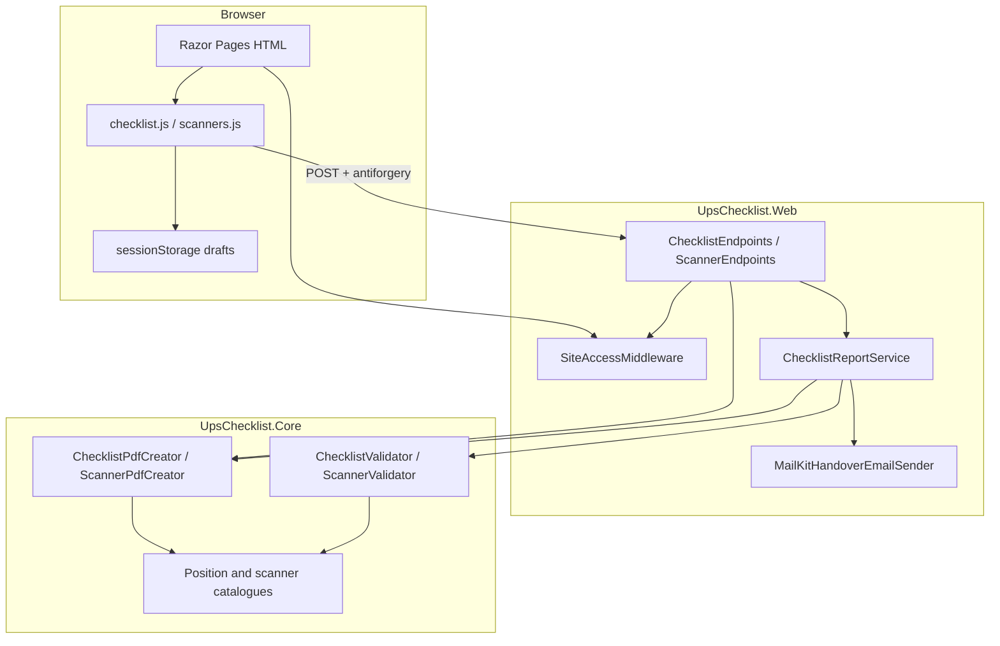

# UPS Checklist architecture

This describes the **implemented** C# / ASP.NET Core application under `dotnet/`. It is a small modular monolith for warehouse shift checklists and scanner handover. It is not a platform, a CMS, a UPS-approved system, or a multi-tenant product.

The repository root still contains the older Node.js app. Do not refactor or deploy that tree by accident.

Related records: [docs/decisions.md](docs/decisions.md).

---

## Purpose

Operators (jambreakers and team leaders) record:

1. Position-specific before/after-sort checks (nine positions).
2. Monday vs Tuesday–Friday scanner lists (80 source rows).
3. Remarks, package counts, typed or drawn signatures.
4. Before-sort and after-sort evidence photos.
5. A PDF, then email and/or WhatsApp handover.

There is **no server-side report archive**. Entries live in the browser tab (`sessionStorage` after refresh). Closing the tab usually clears them; browser session restore can revive a draft, so old drafts expire and Clear draft is available. Generating a PDF or email sends the payload to this app for that request only.

---

## Projects and modules

```
dotnet/
  UpsChecklist.Core/          Business rules, catalogues, PDF writers
    ChecklistPositions.cs
    ChecklistValidator.cs
    EvidenceValidation.cs
    Models/
    Scanners/                 ScannerLists, ScannerValidator
    Pdf/                      ChecklistPdfCreator, ScannerPdfCreator
    Reporting/                Interfaces and email outcome text
    Data/                     workbook-source.json, scanner-lists.json
    Assets/                   Font + workbook images copied to output
  UpsChecklist.Web/           Host, HTTP, Razor, SMTP adapter, static UI
    Program.cs                Configuration, DI, middleware order
    ChecklistEndpoints.cs
    ScannerEndpoints.cs
    Services/ChecklistReportService.cs
    Http/                     Bounded reads, CSRF helper, site-access gate
    Infrastructure/           MailKitHandoverEmailSender, EtherealEmailProvisioner
    Pages/                    Index, Scanners, Login, Logout, Error
    wwwroot/js/               Checklist, scanners, photos, signature, drafts
  UpsChecklist.Tests/         xUnit: Core + in-process HTTP
  tools/ScannerRegressionTests/
    Program.cs                Offline scanner PDF + CSRF/size checks
    *.test.mjs                Node tests (no browser)
```

| Project | May depend on | Must not do |
| --- | --- | --- |
| Core | .NET + bundled assets | HTTP, SMTP, Razor, cookies |
| Web | Core, MailKit, ASP.NET | Invent extra checklist rules |
| Tests | Core + Web | Real SMTP or WhatsApp |

PDF generation stays in Core because it is a pure function of a validated submission. SMTP stays in Web behind `IHandoverEmailSender` so tests can inject a fake.

---

## Runtime dependencies (as built)



Solid arrows are real compile-time or HTTP dependencies. There is no message bus, no database, no repository layer.

---

## Request pipeline

Order in `Program.cs`:

1. Forwarded headers — **only** if `FLY_APP_NAME` is set (Fly terminates TLS).
2. Exception handler + HSTS in non-Development.
3. HTTPS redirection only when Kestrel HTTPS is actually configured.
4. Static files (workbook images, CSS, JS) — **not** behind the password gate.
5. Routing, rate limiter.
6. Cookie authentication.
7. `SiteAccessMiddleware` — shared password when `SiteAccess:Password` is non-empty; production-like hosts refuse misconfigured open access.
8. Authorization.
9. Razor Pages + mapped APIs.

Anonymous paths when the gate is on: `/Login`, `/Logout`, `/Error`, `/health`. Unauthenticated `/api/*` returns 401. Other pages redirect to login. Login POSTs are rate-limited separately from report POSTs.

`APP_MAINTENANCE_MODE=true` (or a live `APP_MAINTENANCE_FLAG_FILE`) short-circuits the pipeline before static files: HTTP 503 + `Cache-Control: no-store` everywhere except `/health`. On Fly.io, treat `APP_MAINTENANCE_MODE` as the durable switch — do not trust the ephemeral machine filesystem as the only shutdown state for a flag file.

Antiforgery is **not** login. It only checks that a POST came from a page this app issued. The password cookie is the access boundary for this prototype. It does not identify a person and is not UPS SSO.

---

## HTTP surface

| Method | Path | Auth if password set | Notes |
| --- | --- | --- | --- |
| GET | `/` | Cookie | Jambreaker checklists |
| GET | `/Scanners` | Cookie | Scanner lists |
| GET/POST | `/Login` | Anonymous | Lowercased shared password; `login` rate limit |
| POST | `/Logout` | Anonymous + cookie clear | Ends the site-access session |
| GET | `/health` | Anonymous | `{ "status": "ok" }` only |
| GET | `/api/handover-config` | Cookie | Recipient, configured flag, WhatsApp number, test-inbox flag |
| POST | `/api/download` | Cookie + antiforgery | PDF via `CreatePdfReport`; form `checklist` JSON or JSON body |
| POST | `/api/email-handover` | Cookie + antiforgery | Full `SendEmailHandoverAsync` workflow |
| POST | `/api/scanners/download` | Cookie + antiforgery | Scanner PDF; JSON body, bounded to 64 KiB |

Limits: checklist body **3 200 000** bytes (chunked counted). Scanner body **65 536** bytes. Rate policy `reports`: 30 POSTs / minute / observed IP / **this process**. Rate policy `login`: 10 POSTs / minute. Testing environment disables both limiters. Two Fly machines do not share the counters.

Clients never choose the email recipient. `HandoverEmail:To` or the built-in handover address is used.

---

## Report generation and delivery

Honest states the UI and API must not collapse:

| State | Meaning |
| --- | --- |
| Reviewed in the tab | User looked at entries; nothing left the device yet |
| PDF generated | Server returned `application/pdf` |
| Download started | Browser save dialog; not a send |
| Email accepted by transport | SMTP `Send` returned; **not** inbox confirmation |
| WhatsApp share opened | Share sheet or chat URL; user may cancel |
| Outcome unknown | Timeout, 502, or cancelled request |

```mermaid
sequenceDiagram
  participant User
  participant UI as Browser tab
  participant Api as ChecklistEndpoints
  participant Svc as ChecklistReportService
  participant Pdf as IChecklistPdfCreator
  participant Mail as IHandoverEmailSender

  User->>UI: Fill checks, photos, signature
  UI->>UI: sessionStorage draft (this tab)
  User->>UI: Email or WhatsApp
  UI->>Api: POST via fetchWithTimeout + RequestVerificationToken
  Api->>Api: Size bound, antiforgery, optional rate limit
  alt WhatsApp / download
    Api->>Svc: CreatePdfReport(payload)
    Svc->>Pdf: Create(submission)
    Api-->>UI: PDF bytes
    UI-->>User: Save file or share sheet
    Note over UI: Share sheet is not delivery
  else Email
    Api->>Svc: SendEmailHandoverAsync(payload)
    Svc->>Svc: Atomic duplicate reserve
    Svc->>Pdf: Create(submission)
    Svc->>Mail: Send to configured address only
    alt Transport accepted
      Api-->>UI: deliveryConfirmed=false
    else Failed before SMTP
      Svc->>Svc: Release reservation
      Api-->>UI: 4xx/5xx definite failure
    else Outcome unknown after SMTP contact
      Note over Svc: Keep reservation
      Api-->>UI: 502; check before retry
    end
  end
```

Duplicate reservations are released only for definite pre-SMTP failures. Uncertain SMTP outcomes keep the key so an identical retry is blocked. The window is not durable and not shared across machines. A queue or database would need explicit approval.

Development without SMTP config may provision an Ethereal test inbox (**Web** `EtherealEmailProvisioner`, not Core). Credentials are **not** printed. The API sets `usesTempInbox` so the UI can say it is not a live company inbox.

---

## Core rules (authoritative)

- Incomplete reports are allowed. Missing checks are not coerced to complete.
- `checks` keys must belong to the selected position; extra keys are rejected.
- Explicit JSON `null` on required fields is rejected (`empty required field`).
- Invalid JSON is rejected as invalid JSON, not as “missing checklist”.
- Photos must be bounded JPEG data URLs; drawn signatures bounded PNGs.
- Scanner date selects Monday vs Tuesday–Friday; weekends have no list.

---

## Frontend (Razor + JS)

No SPA framework. Pages render the shell; modules own state.

| File | Role |
| --- | --- |
| `checklist.js` | Position drafts, render, progress, handover dialogs |
| `session-draft.mjs` | Tab `sessionStorage` snapshot / restore / quota fallback |
| `evidence-binding.mjs` | Photo writes to the position that started the widget |
| `signature-restore.mjs` | Ignore stale `Image.onload` after switch/clear |
| `signature-pad.js` | Pointer drawing; uses restore helper |
| `report-request.mjs` | Timeout/abort wording, antiforgery header |
| `scanners.js` + `scanner-state.mjs` | Per date/version/sheet drafts, immediate persist |
| `whatsapp-handover.js` / `email-handover.js` | POST helpers; no delivery claims |

Draft isolation: each jambreaker `positionId` has its own object. Scanner keys are `date|versionId|sheetId`. Switching list must not leak rows.

---

## Configuration

| Key | Role |
| --- | --- |
| `SiteAccess:Password` | Shared gate; empty = open (tests/local). Compare lowercased. Prefer Fly secret `SiteAccess__Password`. |
| `HandoverEmail:*` | SMTP host, port, user, password, from, optional `To`. Empty password = email disabled. |
| `ScannerLists:ReturnInstruction` | Optional PDF footer line; max 300 chars, no control chars. |

Do not commit real passwords. `appsettings.json` may list a Hotmail *address* as the intended recipient; that does not enable send without a secret password.

Logging: use event ids on PDF/email failures. Do not log names, remarks, images, signatures, or SMTP passwords.

---

## Tests (three categories)

Passing one category does not prove another.

1. **Unit (Core / pure JS)** — validators, null JSON, duplicate guard, signature restore, session-draft parse, scanner date keys. Fast, no HTTP.
2. **HTTP integration (xUnit + `WebApplicationFactory`)** — pages, PDFs, CSRF, 413/415, health, fake SMTP (`deliveryConfirmed: false`, 409 duplicate). Environment `Testing`: no site password, no rate limit, no real mail.
3. **Offline scanner console** — `dotnet run --project tools/ScannerRegressionTests -- <outdir>`: all list variants, CSRF, chunked size. Optional Python appearance check is separate.

There is **no Playwright/CI browser suite** yet (ADR 6). Keyboard, zoom, and camera behaviour are unverified in automation.

### Code coverage (not browser testing)

**Code coverage** measures which lines/branches the automated tests executed. It does **not** open a real browser or prove the UI works on a phone.

Coverlet is already referenced by `UpsChecklist.Tests`. Example (from repo root):

```powershell
dotnet test dotnet/UpsChecklist.Tests/UpsChecklist.Tests.csproj --collect:"XPlat Code Coverage" --results-directory dotnet/TestResults
```

A recent local run on this branch reported about **85% line** / **71% branch** coverage overall (Core higher than Web). Treat that as a signal of gaps, not a quality score. Do not chase 100%.

Optional HTML report (install once: `dotnet tool install -g dotnet-reportgenerator-globaltool`):

```powershell
reportgenerator -reports:dotnet/TestResults/**/coverage.cobertura.xml -targetdir:dotnet/TestResults/html -reporttypes:Html
start dotnet/TestResults/html/index.html
```

```powershell
dotnet test dotnet/UpsChecklist.Tests/UpsChecklist.Tests.csproj
node --test dotnet/tools/ScannerRegressionTests/*.test.mjs
dotnet run --project dotnet/tools/ScannerRegressionTests -- $env:TEMP\scanner-pdfs
```

CI: `.github/workflows/dotnet.yml` runs on pushes/PRs that touch `dotnet/`. It builds Release, runs xUnit with Coverlet, prints line/branch coverage, uploads the Cobertura artifact, runs Node helper tests, and the scanner PDF regression console. Copy of the same file: `dotnet/ci-dotnet.yml.example` (for tokens without `workflow` scope).

---

## Deployment and rollback (Fly)

Implemented host pieces: `dotnet/Dockerfile`, `dotnet/fly.toml` (app `try-sunrise-checklist`, region `ams`, HTTP 8080).

Typical deploy from `dotnet/`: `flyctl deploy --remote-only`. Rollback: deploy the previous image/tag or an earlier git commit from this folder. `min_machines_running = 0` means the machine may be cold; first request can be slow.

Application health path: `GET /health`. It is **not** wired in `fly.toml` yet (hosting change).

Secrets belong in Fly, not git: `HandoverEmail__Password`, `SiteAccess__Password`, and related SMTP fields.

---

## What this architecture does not claim

- UPS operational or brand approval.
- Confirmed email or WhatsApp delivery.
- Per-user audit trails or a report archive.
- Cluster-wide rate limits or idempotency.
- Protection of static `/workbook/` images (they are reference diagrams, served without login).
- That the shared password is strong access control for a public internet app.

---

## Remaining decisions (need approval)

| Topic | If you say yes |
| --- | --- |
| Fly `http_service` check on `/health` | Restarts on failed health; small hosting change |
| Durable duplicate detection | Database or cache; cost + retention policy |
| Per-user login / SSO | Identity provider; not a shared cookie |
| `localStorage` or server drafts | Longer retention of names/photos; privacy review |
| Playwright in CI | Browser install on runners; slower pipeline |
| Real Hotmail/SMTP vs Ethereal | Live mail vs test inbox only |
| Dedicated IPv4 / custom domain | Fly billing |

Until those are approved, keep the current: cookie gate, tab drafts, in-memory duplicate window, fake or test SMTP in automated tests.
